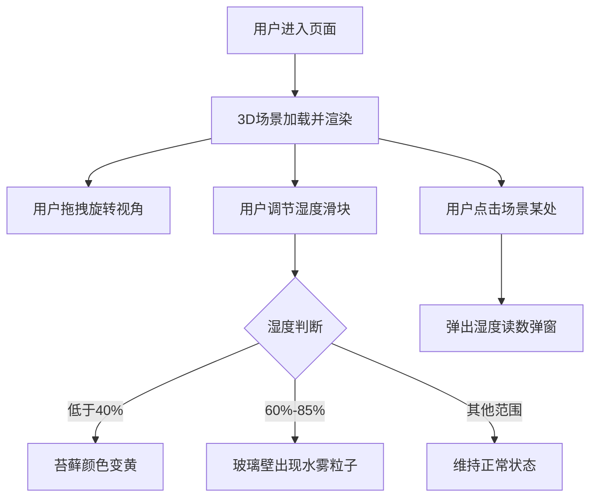

## 1. 产品概述

微型苔藓景观养护助手是一款基于3D可视化技术的互动式养护教育应用。用户可以通过旋转、点击等操作与虚拟玻璃容器中的苔藓景观互动，直观了解湿度对苔藓生态的影响。

- 核心目标：以沉浸式3D体验帮助用户学习苔藓养护知识
- 目标用户：园艺爱好者、植物养护初学者、教育场景用户
- 市场价值：将抽象的养护数据转化为直观的视觉反馈，提升学习趣味性

## 2. 核心功能

### 2.1 用户角色
无特殊角色区分，面向所有用户开放全部功能。

### 2.2 功能模块
1. **3D场景展示**：玻璃容器、苔藓、小石子、木头的立体场景
2. **湿度模拟系统**：可调节湿度值，实时影响场景视觉效果
3. **动态视觉反馈**：
   - 干燥状态：苔藓颜色逐渐发黄
   - 适宜湿度：玻璃壁上出现水雾粒子效果
4. **交互操作**：
   - 鼠标拖拽旋转视角，全方位观察场景
   - 点击场景某处弹出该位置的土壤湿度读数
5. **控制面板**：湿度调节滑块、状态指示器

### 2.3 页面详情
| 页面名称 | 模块名称 | 功能描述 |
|-----------|-------------|---------------------|
| 主页面 | 3D场景渲染区 | 全屏展示玻璃容器景观，支持旋转交互 |
| 主页面 | 湿度控制面板 | 滑块调节湿度数值(0-100%)，显示当前状态 |
| 主页面 | 湿度读数弹窗 | 点击场景时显示位置坐标和湿度百分比 |
| 主页面 | 状态提示栏 | 实时显示当前湿度等级（过干/适宜/过湿） |

## 3. 核心流程

用户进入页面后看到一个玻璃容器中的苔藓景观，可通过鼠标拖拽旋转观察。通过控制面板调节湿度值：湿度低于40%时苔藓逐渐发黄；湿度在60%-85%之间时玻璃壁上出现水雾粒子效果。点击场景中任意位置，会弹出该位置的土壤湿度读数。

## 4. 用户界面设计

### 4.1 设计风格
- **整体风格**：自然清新、宁静治愈，突出微型景观的精致感
- **主色调**：深森林绿 `#2D4A3E`、苔藓绿 `#5B8C5A`、土壤棕 `#8B6914`
- **辅助色**：玻璃蓝 `#A8D5E5`、水雾白 `#E8F4F8`、警告黄 `#C9A227`
- **字体**：标题使用思源宋体，正文使用思源黑体
- **按钮/控件**：圆角半透明玻璃拟态风格
- **图标风格**：简洁线条图标，绿色系填充

### 4.2 页面设计概述
| 页面名称 | 模块名称 | UI元素 |
|-----------|-------------|-------------|
| 主页面 | 3D场景区 | 全屏3D渲染，柔和环境光，场景居中 |
| 主页面 | 控制面板 | 左下角悬浮玻璃卡片，包含湿度滑块和状态指示器 |
| 主页面 | 读数弹窗 | 跟随点击位置的气泡弹窗，显示湿度百分比 |
| 主页面 | 标题区域 | 右上角简洁标题和说明文字 |

### 4.3 响应性
- 桌面端优先设计，场景自适应窗口尺寸
- 移动端支持触摸滑动旋转场景
- 控制面板在小屏幕上自动调整位置

### 4.4 3D场景指导
- **环境与氛围**：柔和的散射光，模拟室内窗台环境，背景为渐变暖白色
- **光照设置**：一盏主方向光（暖白色）+ 环境光 + 玻璃容器内部反射光
- **相机设置**：初始距离适中，可360度水平旋转，限制垂直角度避免穿模
- **构图与焦点**：玻璃容器位于场景中心，苔藓和装饰物构成视觉焦点
- **交互与动画**：
  - 鼠标拖拽控制OrbitControls旋转
  - 水雾粒子缓慢上浮动画
  - 苔藓颜色渐变过渡动画
  - 弹窗淡入淡出效果
- **后处理效果**：轻微泛光、抗锯齿、环境光遮蔽
- **性能预算**：单页加载 < 3MB，帧率 ≥ 30fps
