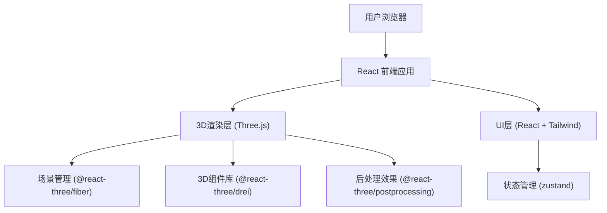

## 1. 架构设计



## 2. 技术描述
- **前端框架**: React@18 + TypeScript
- **构建工具**: Vite
- **样式方案**: TailwindCSS@3
- **3D引擎**: three, @react-three/fiber, @react-three/drei, @react-three/postprocessing
- **状态管理**: zustand
- **后端**: 无（纯前端应用）
- **数据库**: 无

## 3. 路由定义
| 路由 | 用途 |
|-------|---------|
| / | 主页面（3D苔藓景观场景） |

## 4. API 定义
无后端API，所有逻辑在前端实现。

### 核心类型定义
```typescript
interface HumidityState {
  value: number;           // 0-100 湿度百分比
  status: 'dry' | 'normal' | 'optimal' | 'wet';
}

interface ReadingPopup {
  visible: boolean;
  x: number;               // 屏幕坐标X
  y: number;               // 屏幕坐标Y
  humidity: number;        // 该位置湿度值
  position: { x: number; y: number; z: number }; // 3D世界坐标
}
```

## 5. 数据模型
无后端数据存储。应用使用zustand管理以下前端状态：
- 全局湿度值
- 读数弹窗状态
- 场景交互状态
